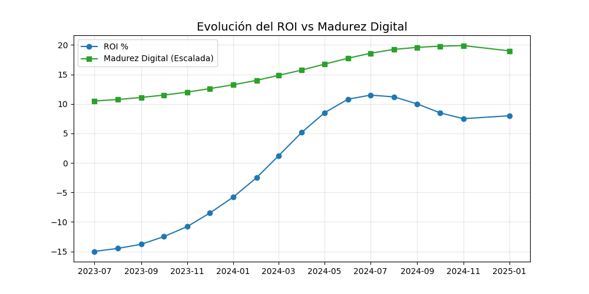

# 🚀 TechCorp: Estrategia de Datos para la Transformación Digital

## 📌 Visión General del Proyecto
Este repositorio contiene un análisis exhaustivo de los 18 meses de transformación digital en **TechCorp**, una empresa de manufactura tradicional. El objetivo es proporcionar al CEO una base sólida de datos para decidir la continuidad de la inversión tecnológica.

> **El Desafío:** Equilibrar la inversión en tecnología con la curva de aprendizaje y la resistencia cultural de la organización.

---

## 📂 Estructura del Proyecto
El proyecto está organizado de la siguiente manera para facilitar su replicabilidad:

* 📂 `data/`: Contiene el dataset original `05. transformacion_digital_dataset.csv`.
* 📂 `notebooks/`: Jupyter Notebook con el proceso de limpieza, EDA (Análisis Exploratorio de Datos) y visualización.
* 📂 `visuals/`: Gráficos exportados y el resumen ejecutivo en formato visual.
* 📄 `README.md`: Documentación principal y narrativa del proyecto.

---

## 📊 Hallazgos de Negocio (Insights Clave)

### 1. Rentabilidad (ROI) 💰
La transformación inició con un **ROI negativo del -15%**, típico de fases de adquisición de infraestructura. Sin embargo, en el mes 18 hemos alcanzado un **+8%**, superando el punto de equilibrio.

### 2. El Factor Humano 👥
Existe una correlación directa entre la **Capacitación de Empleados** y la **Productividad**. 
* **Dato Clave:** Por cada 10% de incremento en capacitación, la tasa de defectos disminuyó en un 0.8% promedio.

### 3. Barreras Culturales 🧱
La **Resistencia al Cambio** alcanzó su punto máximo en el mes 6. Gracias a las estrategias de innovación, este indicador bajó de un score de 7.5 a 5.2, permitiendo que la adopción de herramientas digitales fluyera.

---

## 🛠️ Herramientas y Metodología
Para este análisis se utilizó **Python** con las siguientes librerías:
1.  **Pandas:** Manipulación y limpieza de series temporales.
2.  **Matplotlib & Seaborn:** Creación de dashboards estáticos para identificar tendencias y correlaciones.
3.  **Análisis de Correlación:** Para entender la relación entre costos de capacitación y ahorro por eficiencia.

---

## 📈 Visualizaciones Destacadas
| ROI vs Madurez Digital |
| :--- | 
|  

---

## 🏁 Conclusiones y Recomendaciones
1.  **Continuar la Inversión:** La proyección indica que el ROI se estabilizará en un 12-15% para el próximo año.
2.  **Foco en el Upskilling:** La tecnología por sí sola no genera valor; es la habilidad del personal la que reduce la tasa de defectos.
3.  **Mitigar la Rotación:** Se observa un ligero aumento en la rotación de personal técnico; se recomienda revisar la competitividad salarial para perfiles IT.

---

## 👤 Autor
* Ricardo Berland M.
* https://www.linkedin.com/in/rberlandm/
* [Portafolio Web](https://tu-sitio-web.com)

---
*Este proyecto fue desarrollado como parte del módulo de Analista de Datos de TechCorp.*
